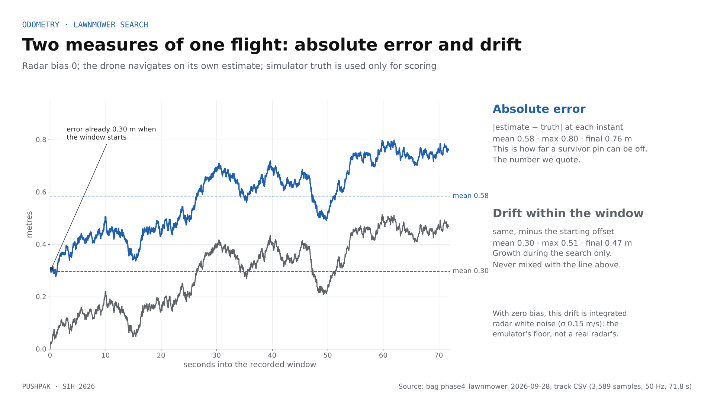
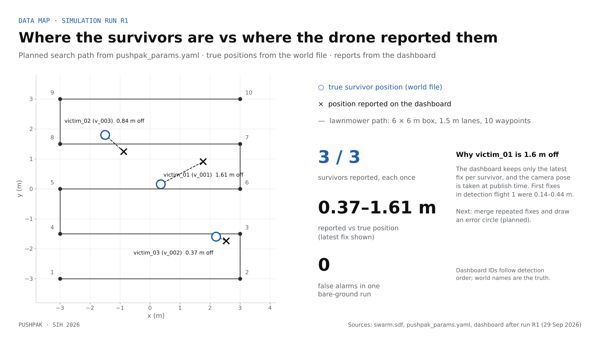
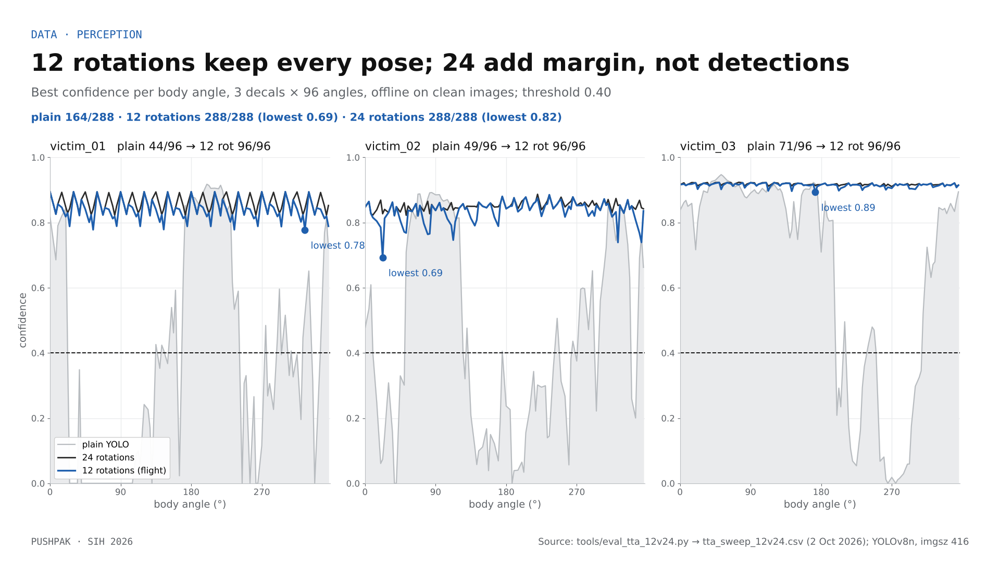
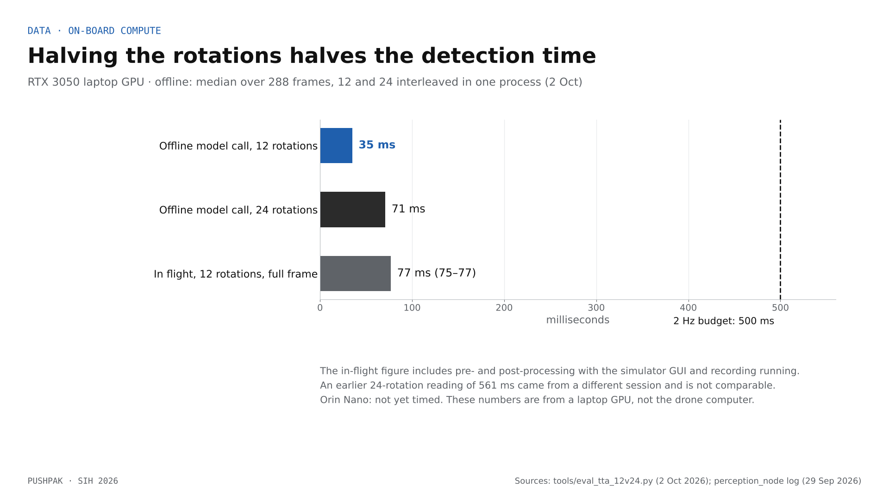
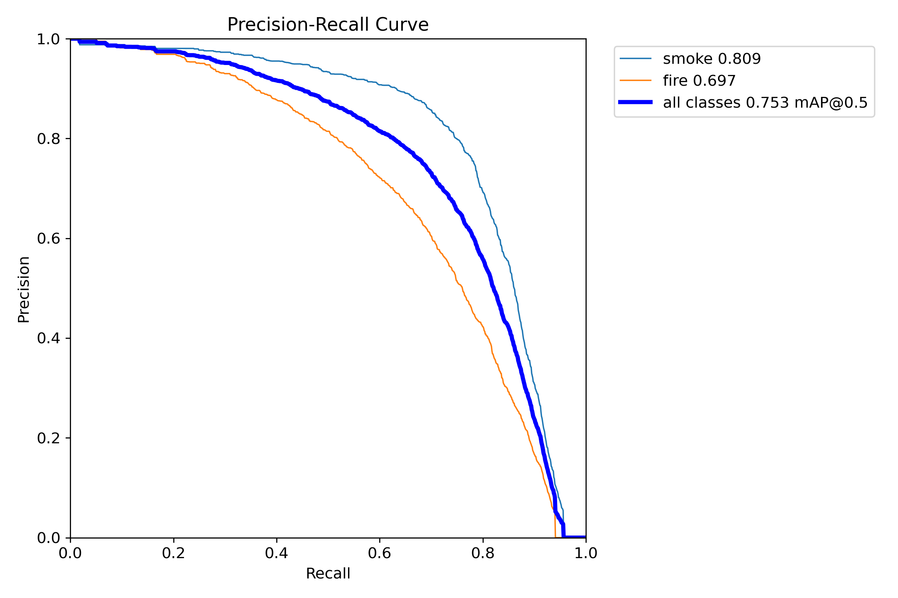
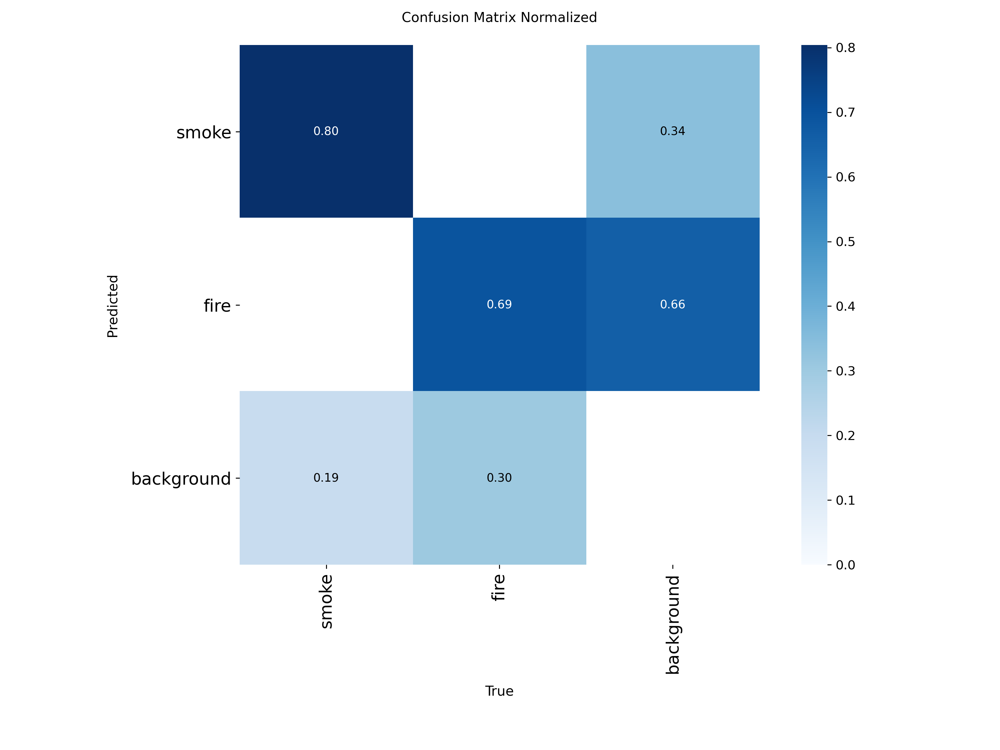
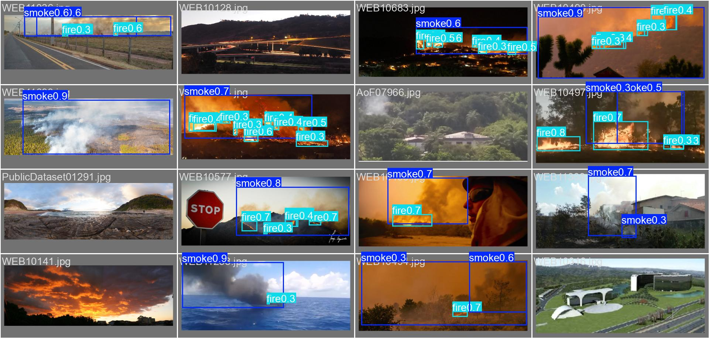

# PUSHPAK · Evidence

Every number PUSHPAK quotes, how it was measured, and where the data lives. If a number is not in this file, it is not a PUSHPAK claim.

**Rule.** Simulation results are measured; hardware is designed and priced, not yet built. Blue in our figures means measured in simulation; dashed or orange means designed or planned.

## Test setup

- ArduPilot SITL Copter 4.4.4 (`865cffa5`), Gazebo Harmonic, ROS 2 Humble, MAVROS 2.14.0, robot_localization 15-state EKF, running in one Docker image (`Dockerfile`, pins in README §1).
- Host: RTX 3050 laptop GPU (6 GB), real-time factor 1.00 unless stated.
- The drone never sees simulator truth. Truth (`/sim/ground_truth/odom`) feeds only the radar emulator and offline scoring (invariant I-8).
- The simulated radar is truth body velocity plus white noise (σ 0.15 m/s) and an optional injected bias. It is an emulator, not a radar model.
- About a dozen named, logged runs between 26 and 29 Sep 2026. Bags, CSVs and recordings are kept on the team drive, not in git.
- Three results are not simulation and are marked so: E10 (two real laptops), E20 (an offline dataset test on an RTX 4070 laptop GPU) and E21 (a bench check with a real camera).

## Results

| # | Date | Result | Value | Source |
|---|---|---|---|---|
| E1 | 28 Sep | Position error with no GPS, lawnmower search, radar bias 0 | **mean 0.58 m, max 0.80 m, final 0.76 m** (absolute error, 72 s window); 10/10 waypoints in 62.3 s (kinematic model 60.3 s) | bag `phase4_lawnmower_2026-09-28`, track CSV |
| E2 | 28 Sep | Same run, drift within the window | mean 0.30 m, max 0.51 m, final 0.47 m | same CSV, column `d_m` |
| E3 | 28 Sep | Same run, speed actually flown | commanded ≤ 0.70 m/s; 1-second speed up to 1.30 m/s, surging with a ≈ 4 s period | same CSV (truth) |
| E4 | 27 Sep | Hover gate, 60 s, radar bias 0 / 0.05 / 0.10 m/s | drift 0.280 / 3.196 / 6.193 m vs predicted 0 / 3 / 6 m; slopes 0.31 / 3.33 / 6.33 m/min; yaw offset ≤ 0.02°; ToF height 1.41–1.69 m | `gate_b0xx_drift.csv`, `tools/eval_hover_gate.py`, README §17 |
| E5 | 27 Sep | Hover gate with the shared noise removed (each bias run minus the bias-0 run; same seed) | bias-driven movement 2.999 m and 6.054 m vs 3.000 and 6.000 m; fitted rates 0.0500 and 0.1001 m/s; the drone's own estimate differed between runs by only 0.009 m and 0.074 m | same CSVs, `docs/ODOMETRY_ANALYSIS.md` |
| E6 | 27–28 Sep | Radar fault → velocity uncertainty Tr(Σv) | healthy median 0.020, max 0.023; 0.094 at 0.5 s, 0.185 at 1 s, 0.42 at 2 s, 2.2 at 5 s, 8.4 at 10 s; back to 0.023 within 2 s of the radar returning | radar-fault runs, README §17 |
| E7 | 27 Sep | FS-4: brain process killed after a 53 s hover | LAND commanded **1.05 s** later; disarmed 5.1 s after that | bag `fs4_land_2_2026-09-27` |
| E8 | 28 Sep | FS-2 isolation, phases A–E | true movement 0.03 / 3.73 / 0.13 / 4.84 / 0.23 m; isolation about 2.0 s after the liveness publisher stopped; resumed at waypoint 3 | FS-2 run, README §18 |
| E9 | 29 Sep | Telemetry live, three peers (drone, gateway, Rust peer) | gateway killed: the drone kept searching (5.9 m in 8 s); last peer killed: FS-2 decided 0.05 s after the peer list emptied and held within 0.10 m for 6 s; one survivor sent three times showed once | live run 29 Sep 00:35 |
| E10 | 26 Sep | T-1: two real laptops (Ubuntu + Mac), laptop-hosted hotspot, no router or broker (**hardware**) | peer loss detected in **1.78 s**; phone hotspots and campus Wi-Fi block device-to-device traffic | `docs/ZENOH_TWO_LAPTOP_TEST.md` |
| E11 | 28 Sep | Gateway + dashboard against the Rust peer | link ONLINE at 0.5 s; one oversize and one id-mismatch message rejected; 26 heartbeats from the Rust peer | README §18 |
| E12 | 29 Sep | Detection flight 1 | **3/3** found; first-fix error 0.14–0.44 m; 5 detections, 26 crops | bag `phase5_detect` (reindexed) |
| E13 | 29 Sep | Bare-ground run (false alarms) | **0** detections | bag `phase5_bare` |
| E14 | 29 Sep | Run R1 (the demo video) | **3/3** found, 84 detections; dashboard confidence 41 / 84 / 67 %; latest-fix error 0.37–1.61 m | bag `phase5_R1_2026-09-29`, recording `pushpak_R1_2337.mp4` |
| E15 | 29 Sep | Offline rotation sweep, 24 rotations (clean images, 3 decals × 96 body angles) | plain YOLOv8n **164/288** above 0.40; 24 rotations (15° steps) **288/288**, lowest 0.82 (victim_02 at 67.5°) | `tta_sweep.csv`, `tools/eval_tta_sweep.py` (Raunak) |
| E16 | 29 Sep | Detection time, 12 rotations, RTX 3050 laptop GPU | **75–77 ms** per frame (Gazebo GUI and recording running) | perception_node log |
| E17 | 2 Oct | Automated tests on `arch/v2` 3329075 | 91 pass: pushpak_brain 32, perception 46, gateway 6, Rust 5 + 2 | LOQ container run |
| E18 | Sep | Docker image rebuilt on a second machine | stack rebuilt and ran; the image also builds on an RTX 4070 laptop (2 Oct) | `Dockerfile` |
| E19 | 2 Oct | Offline 12 vs 24 rotations, same images, one process, RTX 3050 laptop GPU | **12 rotations (flight setting): 288/288**, lowest 0.69 (victim_02 at 22.5°), 26 of 288 below 0.80; 24 rotations: 288/288, lowest 0.82, reproducing E15 within 0.001; model call median **35.2 ms vs 71.0 ms** | `tools/eval_tta_12v24.py`, `tta_sweep_12v24.csv` |
| E20 | 4 Oct | Fire and smoke detector, D-Fire test split (**offline, not simulation**) | YOLOv8n from COCO weights, fine-tuned on the D-Fire training split. 4,302 test images, 5,186 boxes: **smoke mAP50 0.809** (P 0.784, R 0.762, mAP50-95 0.492; 2,311 boxes in 2,077 images), **fire mAP50 0.697** (P 0.691, R 0.633, mAP50-95 0.364; 2,875 boxes in 1,113 images); both classes mAP50 0.753, mAP50-95 0.428 | `tools/hazard_dfire.yaml`, run `runs/hazard/dfire_y8n` and `dfire_y8n_test` (weights and curves on the team drive) |
| E21 | 4 Oct | Bench check: real camera, real person (**hardware**) | Laptop webcam, one person lying on the floor in dim light, YOLOv8n person class on a laptop, overlay rate 8–11 fps; the flight controller (HAKRC F405 V2, Betaflight 4.5.1) supplied roll, pitch and heading live over USB. A box was on screen in **about 55 %** of the 625 recorded frames (20.9 s); longest gap about 0.7 s; one person sometimes drew two boxes | screen recording on the team drive (Kanishk's bench script) |

## Two error metrics, never mixed

The lawnmower track (E1, E2) can be scored two ways.

- **Absolute error** is the distance between the drone's own position estimate and simulator truth at the same instant: mean 0.583 m, max 0.798 m, final 0.760 m. This is how far a survivor pin can be off, and it is the number we quote.
- **Drift within the window** removes the offset the estimate already had when the 72 s recording began (0.30 m) and measures only the growth during the search: mean 0.297 m, max 0.513 m, final 0.468 m.

Both are correct; they answer different questions. A figure that labels the second as "error" is wrong.



## Survivor mapping, run R1

World names are the truth; dashboard IDs follow detection order.

| World name | True position (m) | Dashboard ID | Reported (m) | Latest-fix error | Confidence |
|---|---|---|---|---|---|
| victim_01 | (0.35, 0.15) | v_001 | (1.77, 0.90) | 1.61 m | 41 % |
| victim_02 | (−1.50, 1.80) | v_003 | (−0.88, 1.24) | 0.84 m | 67 % |
| victim_03 | (2.20, −1.60) | v_002 | (2.54, −1.74) | 0.37 m | 84 % |

The dashboard keeps only the latest fix of each survivor, and the camera pose is taken at publish time; that is why victim_01 ends 1.6 m off while first fixes in detection flight 1 were 0.14–0.44 m. Merging repeated fixes with an error circle is planned (`docs/MISSION_DESIGN.md`).



## Rotation sweep: 12 vs 24 rotations

The flight setting (12 rotations, 30° apart) finds every test pose that 24 rotations find, with less margin (lowest 0.69 against 0.82), at half the model time.





## Fire and smoke detector (E20)

How it was run, 4 Oct, in the project container on an RTX 4070 laptop GPU (Ultralytics, image size 640, batch 32):

```
yolo detect train model=/workspace/yolov8n.pt data=tools/hazard_dfire.yaml epochs=30 imgsz=640 batch=32 workers=4 device=0 patience=8 project=runs/hazard name=dfire_y8n exist_ok=True
yolo detect val model=runs/hazard/dfire_y8n/weights/best.pt data=tools/hazard_dfire.yaml split=test imgsz=640 batch=32 device=0 project=runs/hazard name=dfire_y8n_test exist_ok=True
```

- Dataset: D-Fire, pre-split (Venâncio et al., Neural Computing and Applications, 2022; [github.com/gaiasd/DFireDataset](https://github.com/gaiasd/DFireDataset)). Classes: 0 smoke, 1 fire. Images with neither are kept as negatives.
- The best checkpoint was chosen on the validation split. The test split was scored once, after training. Ultralytics skipped the few test images whose labels fall outside the image; 4,302 were scored.
- The dataset and the weights are not in git (README §14).







## Design parameters (set, not measured)

| Parameter | Value | Where |
|---|---|---|
| Survivor report size | ≤ 48 B worst case (8 varint fields); anything over 50 B is rejected | `proto/pushpak.proto`, README §8 |
| Peer timeout | 1.75 s silent → dropped; FS-2 after 2.0 s with no peer | `pushpak_params.yaml` |
| Detection | 2 Hz cap, confidence ≥ 0.40, image size 416, 12 rotations × 30° in flight | `pushpak_params.yaml` |
| Search | 6 × 6 m box, 1.5 m lanes, 10 waypoints, ≤ 0.70 m/s commanded, kp 0.8, guidance 20 Hz | `pushpak_params.yaml` |
| FS-3 threshold | Tr(Σv) > 0.2 m²/s² (about 9× the healthy maximum) | README §17 |
| Radar emulator | σ 0.15 m/s white noise; bias sweep 0 / 0.05 / 0.10 m/s | README §15, §17 |

## How not to read these numbers

- **0.58 m is an emulator result.** The radar in simulation is truth plus white noise. A real radar adds bias, scale-factor and mounting errors; with a constant bias b the error grows as b × t (E4, E5). See `docs/GPS_INDEPENDENCE.md`.
- **35, 71 and 77 ms are laptop-GPU numbers, not the drone computer.** The Orin Nano has not been timed. 35 vs 71 ms is the controlled comparison (model call only, offline); 77 ms is the full in-flight frame with the simulator running. An earlier 24-rotation reading (561 ms) came from a different session and is not comparable.
- **288/288 comes from three clean rendered images**, at both 12 and 24 rotations. Three images are not a recall measurement; partly buried, dusty people are untested.
- **3/3 is two flights over three rendered survivors on clear ground.** It shows the pipeline works end to end, not field recall.
- **1.78 s is the only network result on real hardware** (two laptops). Everything else ran in simulation, except the offline dataset test (E20) and the bench check (E21).
- **0.81 and 0.70 are dataset scores, not flight results.** D-Fire images are ground-level and surveillance views, not a drone looking down from 30–50 m. The model is not in `perception_node`, has not run in simulation and has not been timed on a drone computer. There are no water or damage classes.
- **The bench check is one person, one room, 21 s.** It shows the detector working on a real camera with intermittent boxes; it is not a recall measurement. The clip does not record the rotation setting or the compute device, and nothing was flying.
- **The cost (₹3.87–4.50 lakh) is a prototype parts estimate**, not a unit price, and predates the Drone A additions (`docs/HARDWARE_AND_THERMAL.md`).

## Pending measurements

| Measurement | Replaces |
|---|---|
| YOLOv8n with TensorRT on the Orin Nano under sustained load, with temperatures | "Orin not timed" |
| ArduPilot behaviour when the companion computer loses power | "FC fail-safe: to measure" |
| Hover endurance of the 5-inch test quad, then Drone B | the single-digit-minutes estimate |
| A real IWR6843 on the bench with a Doppler ego-velocity estimator | the emulated radar |
| Detection on real or aerial search-and-rescue images | three rendered decals |
