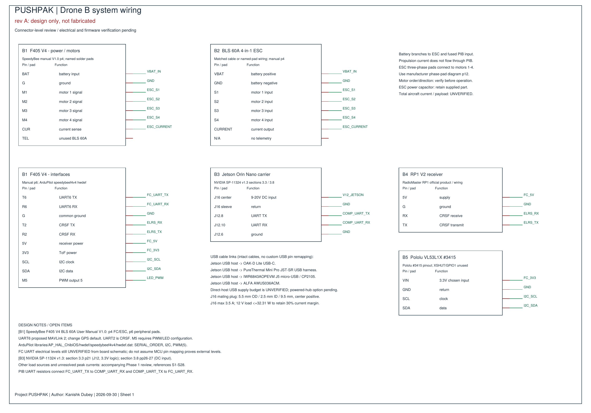
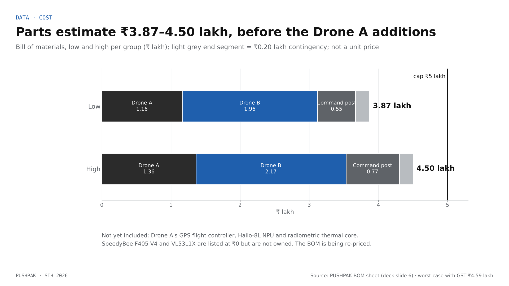

# PUSHPAK · Hardware and thermal design

**Status: designed and priced, not built.** No PUSHPAK drone has been fabricated or flown. The Drone B wiring (rev A) and the power-and-interface board are design documents by Kanishk Dubey (29–30 Sep 2026); values marked unverified there are unverified here.

## What the team owns today (bench)

| Item | Use |
|---|---|
| HAKRC flight controller + HAKRC 3B60A ESC | Bench flight controller. It runs Betaflight; ArduPilot has no build for it, so the planned ArduPilot desk rig (README tripwire T-6) was not built |
| 5-inch test quad | Airframe for propulsion and endurance tests before the Drone B build. Not flown under the PUSHPAK stack |
| Laptop webcam, laptops | Bench camera and compute. A bench script reads the flight controller's attitude over Betaflight MSP and runs person detection on the webcam; it is labelled "bench rig – not flown" and is not part of the flight stack |

Everything else below is a design selection, not an owned part. In particular the SpeedyBee F405 V4 and the VL53L1X are listed in the BOM at ₹0 but are **not owned** and must be bought.

## Drone B · search scout (design)

Small, GPS-free airframe that enters the flagged structure.

| Function | Part | Notes |
|---|---|---|
| Companion computer | NVIDIA Jetson Orin Nano Super developer kit | Runs perception, estimation, guidance and telemetry |
| Flight controller | SpeedyBee F405 V4 (ArduPilot) + BLS 60A 4-in-1 ESC | Not owned |
| Velocity | TI IWR6843 60 GHz radar (IWR6843AOPEVM) | Ego-velocity estimator to be built |
| Height | VL53L1X ToF (Pololu #3415 breakout as the reference) | ≤ 4 m; 3.3 V I²C |
| Camera | Luxonis OAK-D Lite | RGB for detection, depth for obstacle avoidance (planned) |
| Thermal | FLIR Lepton 3.5 on a PureThermal Mini Pro | 160 × 120, under 9 Hz; fusion rule not designed |
| Radio | ALFA AWUS036ACM Wi-Fi (MT7612U) | Same adapter on every Linux peer |
| RC receiver | RadioMaster RP1 V2 (ExpressLRS, CRSF) | Pilot override |
| Positioning | UWB tag (Makerfabs ESP32 UWB DW3000 as the reference) | Resets against anchors at the entrance (planned) |
| Propulsion reference | 4 × EMAX ECO II 2306 1700 KV + DALPROP Cyclone 5040 | Manufacturer bench chart only; ducted frame + prop guards planned |

Weight and endurance are not established. The deck states an estimate of single-digit minutes per 6S pack; the hover test on the 5-inch quad comes first.

### Wiring rev A (design only)

- Battery → ESC directly (propulsion current never flows through the interface board) and → a fused branch to the power-and-interface board.
- Flight controller UART6 → MAVLink 2 to the Jetson J12 header (pins 8/10, 3.3 V logic) through series resistors; TX/RX cross once, common ground; the flight controller's supply pin is not connected to the companion.
- Receiver on UART2 (CRSF); ToF on the flight controller's I²C at 3.3 V; LED output on the M5 PWM pad.
- USB from the Jetson to the OAK-D Lite, PureThermal + Lepton, IWR6843 (micro-USB) and the ALFA adapter.

Unverified: flight-controller UART logic levels, fuse value, USB power budget, motor order and direction, total aircraft current.

## Power-and-interface board, rev A (concept)

| Block | Design direction | Status |
|---|---|---|
| Input protection | Fuse, reverse-polarity MOSFET stage, 28 V-standoff TVS, 63 V bulk capacitors | Parts and values pending |
| 12 V rail for the Jetson | TI LM5176 four-switch buck-boost (holds 12 V across 11.1–25.2 V input) | Controller chosen; power stage not designed |
| 5 V auxiliary rail | TI LM5146 synchronous buck, 8 A capacity target (≥ 6.5 A needed for a 5 A load with 30 % margin) | Controller chosen; power stage not designed |
| Interfaces | Flight-controller UART bridge with series resistors and ESD protection; I²C header; LED driver | Pinout drafted |
| Board | ≤ 50 × 50 mm, two layers, 30.5 mm M3 mounting pattern | Concept layout only; no design-rule check |

The concept layout imports into EasyEDA but is **not to be ordered or fabricated**: regulator circuits are placement envelopes, and the first layout has known defects (a trace through a mounting hole, silkscreen on connector pads). First-pass trace widths follow IPC-2221 for a 10 °C rise (Jetson path 3.5 A → 100 mil; 5 V at 8 A → 220 mil; combined input 9.6 A → 300 mil) and still need thermal verification.

### The power budget does not close yet

The Jetson's DC jack (J16) accepts 9–20 V and is rated 3.5 A. At 12 V that is 42 W, or **32.3 W** with the team's 30 % margin rule. The module alone is allocated 25 W in its highest power mode and the OAK-D Lite about 5 W at full use: 30 W before the carrier board's losses, the fan, the Lepton, the radar and the Wi-Fi adapter. With margin that partial sum is already 39 W.

Options under review:
1. **A 19 V companion rail** (inside J16's range): 66.5 W at 3.5 A, 51 W with margin. Changes the regulator design.
2. **Power the USB peripherals from a separate, protected 5 V branch**, keeping only data on the Jetson's USB ports.
3. **Cap the loads**: run the Jetson in a lower power mode and confirm each peripheral's real draw.

Whichever is chosen, the Jetson's USB ports share 3 A per dual-port stack, so the peripherals cannot all draw freely from them.

## Drone A · survey (design)

| Function | Part (deck) | Reference in the power review |
|---|---|---|
| Flight controller | ArduPilot flight controller + GNSS | Holybro Pixhawk 6C with PM02 V3 power module |
| Airframe | Medium quad | Holybro S500 V2 ARF kit |
| On-board AI | Raspberry Pi 5 + Hailo-8L NPU | — |
| Cameras | Pi Camera 3; radiometric thermal core | — |
| Height | Benewake TF03 LiDAR | UART variant; revision to be confirmed |
| Positioning, radio | UWB tag; Wi-Fi mesh radio | ALFA AWUS036ACM |

Navigation: GNSS when the fix is healthy, with a planned non-GPS fallback (`docs/GPS_INDEPENDENCE.md`). Power: the Pi 5 needs a compliant 5 V / 5 A supply path to allow full USB current; a plain regulator plus USB-C socket is not a USB-PD source.

## Command post (design)

Gateway laptop (Zenoh peer 0) with the React dashboard; four UWB anchors at the entrance, two of them surveyed with GNSS so pins come out in latitude and longitude; charging from the response vehicle or a generator.

## Thermal management

Drone B puts a 7–25 W computer, a camera, a radar and a regulator board inside a guarded, ducted frame that works in dust, near fires and in Indian summer heat. Heat is a design constraint, not an afterthought. Nothing below has been measured yet.

### Heat sources

| Source | Size | Note |
|---|---|---|
| Jetson Orin Nano Super module | 7, 15 or 25 W power modes | Perception at 12 rotations × 2 Hz is the main sustained load |
| OAK-D Lite | 2.5–3 W streaming; about 5 W at full use | On-camera processing adds heat at the camera |
| Lepton + PureThermal, IWR6843, Wi-Fi adapter | not yet budgeted | Each needs a measured figure |
| Regulators on the power board | conversion losses | Scale with the rail loads; set the copper and trace widths |
| ESCs and motors | dominant electrical power in flight | Ducts reduce airflow over them |
| LiPo pack | internal resistance heating under load | Hot ambient shortens safe flight time |

### Risks

- **Throttling.** Under sustained load the Orin lowers its clocks when its heatsink cannot shed heat. Detection time then rises and the 2 Hz budget can be missed. The 77 ms figure comes from a laptop GPU and says nothing about this.
- **Dust and ducts.** A ducted frame with guards protects props but reduces airflow over the electronics; rubble dust clogs fans and fins.
- **Hot environments.** Searching near flagged fires or in summer sun raises the ambient temperature that every heatsink starts from.
- **On the ground.** Between sorties there is no prop wash; the computer keeps running for telemetry and logs.

### Design measures

| Measure | Effect |
|---|---|
| Detection capped at 2 Hz | Bounds the average perception load |
| 12 rotations instead of 24 | Halves the model time: 35 vs 71 ms offline on the laptop GPU, with every test pose still found |
| Rotation-augmented training (roadmap) | Removes test-time rotation: about 1/12 of today's detection compute |
| TensorRT INT8 engine on the Orin | Less work per frame than the PyTorch model |
| Copper heat pipes to a heatsink in the prop wash | Moves heat from the module to where airflow exists in flight |
| Lowest power mode that meets the 2 Hz budget | Picked from measurement, not assumed |
| Thermal margin on the power board | IPC-2221 trace widths for a 10 °C rise; regulator thermal check before release |
| Battery temperature and the battery fail-safe | Return to the entrance on low battery; never land in the void |

### Measurements needed

1. YOLOv8n TensorRT on the Orin under sustained load inside a mock enclosure: detection time, clocks and module temperature over 10 minutes (`tegrastats`).
2. Jetson input power at J16 with all peripherals running, to settle the 12 V vs 19 V decision.
3. Hover on the 5-inch quad: pack and ESC temperatures alongside endurance.

## Cost

Prototype parts estimate for both drones and the command post: **₹3.87–4.50 lakh** (worst case with GST ₹4.59 lakh) against a ₹5 lakh cap. It predates three Drone A additions (GNSS flight controller, Hailo-8L NPU, radiometric thermal core) and lists the F405 V4 and VL53L1X at ₹0. The BOM is being re-priced; until then, treat the total as incomplete.

## Regulation

Field trials need the Drone Rules 2021 steps: a unique identification number on Digital Sky, a certified remote pilot, and permission for autonomous flight.

## Sources

- Kanishk Dubey, *PUSHPAK Drone B system wiring and shared PIB, rev A*, 30 Sep 2026 (design only), and *PIB rev A Phase 1 review* and *PCB notes*, 29–30 Sep 2026, which cite the manufacturer documents used above (NVIDIA SP-11324 carrier-board specification v1.3; NVIDIA Orin Nano Super power modes; Luxonis OAK-D Lite; TI LM5176 and LM5146 datasheets; SpeedyBee F405 V4 manual; Raspberry Pi power documentation).
