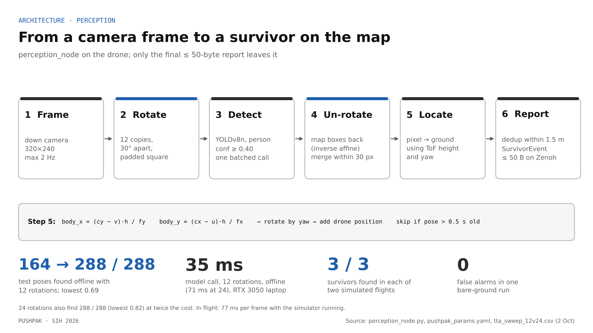

# PUSHPAK · Mission design and planned capabilities

The submitted design covers the whole mission: survey, search, prioritise and route, alert. Only the search step runs today, in simulation. This document describes how the planned parts are meant to work, which design choices are fixed, and which questions are still open. Status labels: **Built (sim)**, **Partial**, **Planned**.

**Scope.** Earthquake, collapsed buildings. Floods and landslides need square kilometres of coverage, flight over water and much longer endurance; they are a later extension.

**Principle.** The system recommends; the commander decides. PUSHPAK never labels a structure or a route "safe": structural stability is a structural engineer's call, and every downed wire is treated as live.

## The mission

| Step | Inputs | Output | Status |
|---|---|---|---|
| 1 · Survey (Drone A, 30–50 m) | RGB + radiometric thermal imagery, GNSS or fallback navigation, occupancy prior | Ranked structures, hazard map, radio relay | Planned |
| 2 · Search (Drone B) | Radar, IMU, ToF, RGB (thermal next) | Survivor pins + photos | **Built (sim)** for RGB, one survivor class, clear ground |
| 3 · Prioritise + route (command post) | Survivor pins, hazard map, commander input | Recommended rescue order + suggested route | Planned |
| 4 · Alert + respond (dashboard) | Everything above | Live map, alerts, acknowledgements | Partial: pins and link status live in sim |

## 1. One map for both drones

**Frame.** At setup the team places UWB anchors at the entrance of the site. Their position defines the origin. Two of them are surveyed with GNSS, which fixes the rotation between the local frame and latitude/longitude. Drone A's map (GNSS-referenced) and Drone B's pins (metres from the entrance) are both expressed in that frame. Rotation error matters most: 5° puts a pin 30 m inside a structure 2.6 m off.

**Layers.**

| Layer | Source | Content |
|---|---|---|
| Site overview | Drone A snapshots | Georeferenced images of the site |
| Structures | Drone A + commander | Outline, building type, flagged damage, rank |
| Hazards | Drone A detectors + commander | Fire, smoke, water, heat, flagged damage, downed wires; each a zone with confidence and source image |
| Survivors | Drone B | Merged pins with an error circle, confidence, photo, condition flags |
| Route | Command post | Suggested path and its cost; commander's decision |

**Bandwidth rule.** Heavy data stays on the drone; only small messages cross the link first. A survivor alert is ≤ 48 bytes; photos and map tiles follow when the link allows.

Today: survivor pins in metres from the command-post origin, drawn live on the dashboard (Built, sim). Everything else: Planned.

## 2. Hazard detection (Drone A)

**Design.**
- A radiometric thermal core measures temperature per pixel; hotspots above a threshold become heat or fire candidates.
- Fire, smoke and water classes run as a detector on a Hailo-8L NPU beside the Raspberry Pi 5.
- Visible structural damage is flagged for review by an engineer, never classified as stable or unstable.
- Each hazard becomes a zone on the map with its class, confidence and the image that produced it.

**Ranking which structure to search first.** Thermal from 30–50 m cannot see people under a slab, so Drone A ranks structures with an occupancy prior (building type, time of day) plus visible damage. The prior comes from census or municipal records and from the commander.

**Open.** Detector architecture, training datasets and target recall per class are not chosen; thermal thresholds are not set; there is no detector yet for downed wires (they are marked by the commander). Answering this is the first item of roadmap Phase 2.

## 3. Survivor detection (Drone B)

**Built (sim).** A downward camera frame (320 × 240, at most 2 Hz) is rotated into 12 copies 30° apart (offline: 288/288 test poses found, lowest confidence 0.69), run through YOLOv8n (COCO person class, confidence ≥ 0.40) in one batched call, mapped back through the inverse rotation and merged within 30 px. The pixel is projected to the ground using the ToF height and the estimated yaw; a report is skipped if the pose is older than 0.5 s. Repeated reports within 1.5 m are deduplicated on the drone.

**Planned.**
- **Thermal.** The Lepton 3.5 (160 × 120, under 9 Hz) is added to the pipeline. Open: aligning thermal and RGB pixels, and the fusion rule (for example, a person candidate confirmed by a body-temperature region).
- **Condition flags.** Thermal flags a possibly cold body (hypothermia risk) and no movement between passes. These are rough signals shown to the commander, never a diagnosis.
- **Rotation-augmented training** on aerial search-and-rescue images, replacing test-time rotation and cutting detection compute to about one-twelfth.
- **Recall on realistic images.** Today's results come from three rendered figures; partly buried and dusty people are untested.

## 4. Survivor emergency alerting

**Built (sim).** Each survivor is sent as a Protobuf `SurvivorEvent` (drone, survivor ID, position in millimetres, confidence, hit count; ≤ 48 B) on `pushpak/survivor/{drone_id}`; the gateway validates size and sender and shows it on the dashboard.

**Gaps today.** Reports sent while the link is down are lost, and the dashboard keeps only the latest fix of each survivor (why victim_01 ended 1.6 m off in run R1).

**Planned design.**

| Element | Design |
|---|---|
| On-drone log | Append-only log of every detection with drone ID, detection ID and sequence number, plus the crop image |
| Store and forward | On reconnect, the command post asks for everything after the last sequence it holds; Zenoh supports this with a publication cache on the drone and a querying subscriber at the command post |
| Acknowledgement | The command post acknowledges each sequence number; the drone keeps unacknowledged reports |
| Fix merging | Repeated fixes of one survivor are merged by their uncertainty (estimator covariance plus pixel error) into one pin with an error circle |
| Photo | The ≤ 48-byte alert goes first; the crop follows when bandwidth allows, so the commander can verify |
| Alert to responders | Dashboard alert with position, error circle, photo, condition flags; acknowledged by a person |

## 5. Rescue order and route generation (command post)

**Rescue order.** The command post ranks known survivors and shows its reasons:

| Factor | Meaning |
|---|---|
| Nearby danger | Distance to flagged fire, water, damage, downed wires |
| Condition | Thermal flags (possibly cold body, no movement) |
| Reachability | Length and cost of the best route |
| Confidence | Detection confidence and error-circle size; unsure pins go with their photo |

The weights are deliberately not fixed in code yet: they should be set with responders (NDRF/SDRF), and the commander can reorder at any time.

**Route.** The map becomes a cost grid. Flagged fire, water, damage and downed wires are no-go zones; other cells cost more near hazards. A* finds the first route; D* Lite (Koenig & Likhachev, 2002) replans quickly as hazards are added or removed. The output is a *suggested* route and is shown with the hazards it avoids; the commander confirms before anyone moves.

**Open.** There is no walkability layer yet (slope, footing, debris height), and no detector for walls or wires; until then the route avoids only what has been flagged.

## 6. Radio links and behaviour when they fail

| Situation | Behaviour | Status |
|---|---|---|
| Command post lost, another peer alive | Search continues | Built, tested (5.9 m in 8 s) |
| All peers lost | Hold, resume at the same waypoint when a peer returns | Built, tested (≈ 2 s to hold) |
| All peers lost (next) | Retrace to the last point with a link | Designed |
| Drone B deep inside concrete | Relay nodes dropped at void entrances; Drone A relays at the entrance | Designed |
| Drone A lands to swap its pack | Drone B holds or retraces to the entrance; it never lands in the void | Designed |
| Battery low | Return to the entrance | Designed |

## 7. Dashboard

Built (sim): live map with pins, telemetry, link status, the live drone ID; a null-safe link panel that shows "not measured" instead of an invented signal strength. Planned: photo feed, hazard markers, error circles, rescue-order list with reasons, route overlay, alert acknowledgements, mission status.

## 8. Field operations

- **Setup:** UWB anchors at the entrance, two surveyed with GNSS; command-post laptop and its own Wi-Fi access point (phone hotspots and campus networks block device-to-device traffic, measured 26 Sep).
- **Sorties:** short, with pack swaps; endurance per 6S pack is estimated at single-digit minutes and will be measured.
- **Charging:** from the response vehicle or a generator at the command post; no grid needed.
- **Pins:** metres from the command post today; latitude/longitude after the anchors are surveyed.
- **Rules:** Drone Rules 2021 (UIN on Digital Sky, certified remote pilot, permission for autonomous flight).
- **Role:** PUSHPAK complements NDRF dogs, acoustic and seismic life detectors and probe cameras: the scout goes onto unstable rubble first, and existing tools confirm what it finds.

## Open questions

| # | Question | Needed for |
|---|---|---|
| 1 | Which hazard detector and datasets; target recall per class | Hazard map |
| 2 | Drone A's non-GPS navigation chain | Survey without GNSS |
| 3 | RGB–thermal alignment and fusion rule | Thermal on Drone B |
| 4 | Rescue-order weights, agreed with responders | Rescue order |
| 5 | Walkability layer and wall/wire detection | Routes beyond flagged hazards |
| 6 | Real survivor recall on aerial images, partly buried people | Credible detection claims |
| 7 | Weather limits: rain, dust, monsoon wind at 50 m | Field operation |
