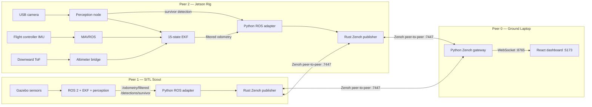
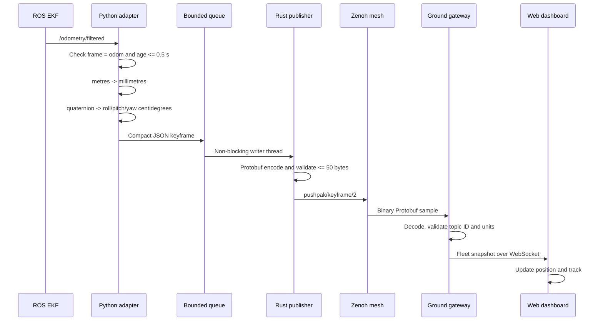
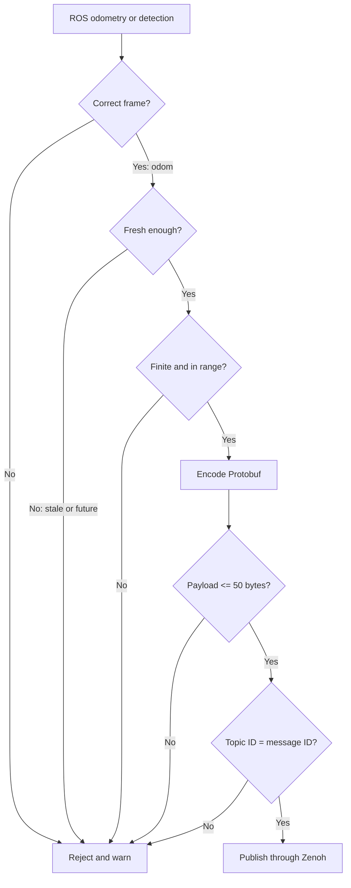
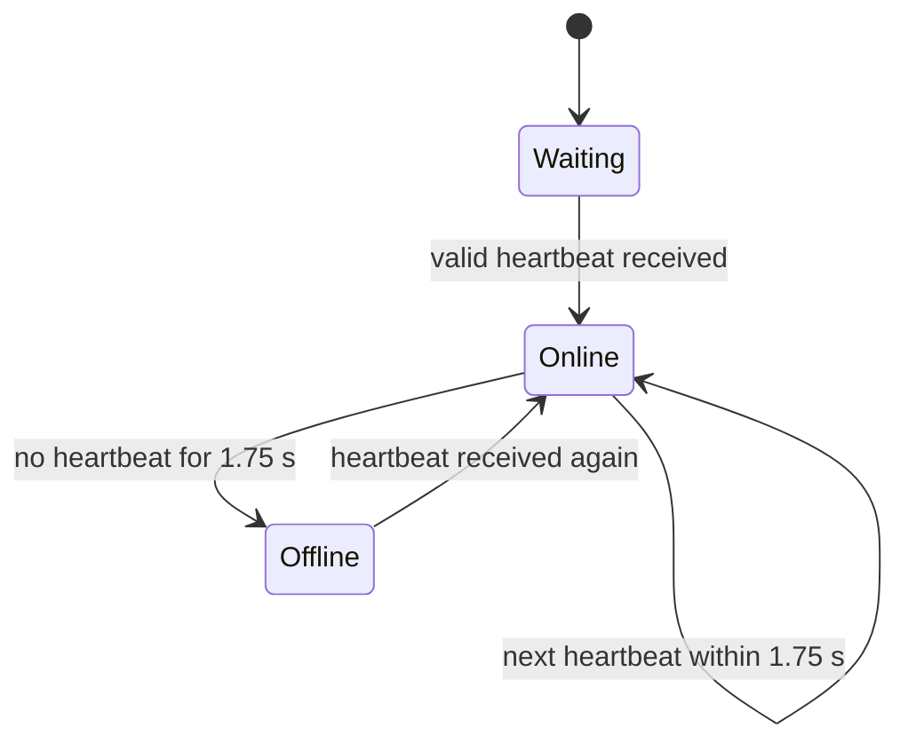
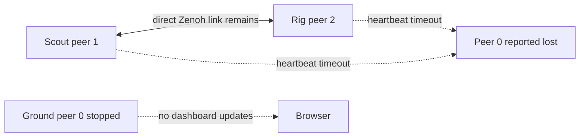
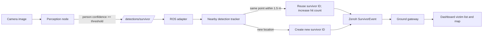
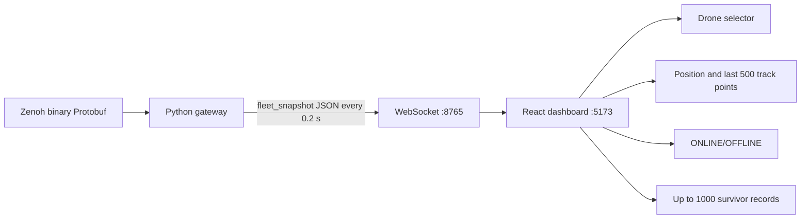
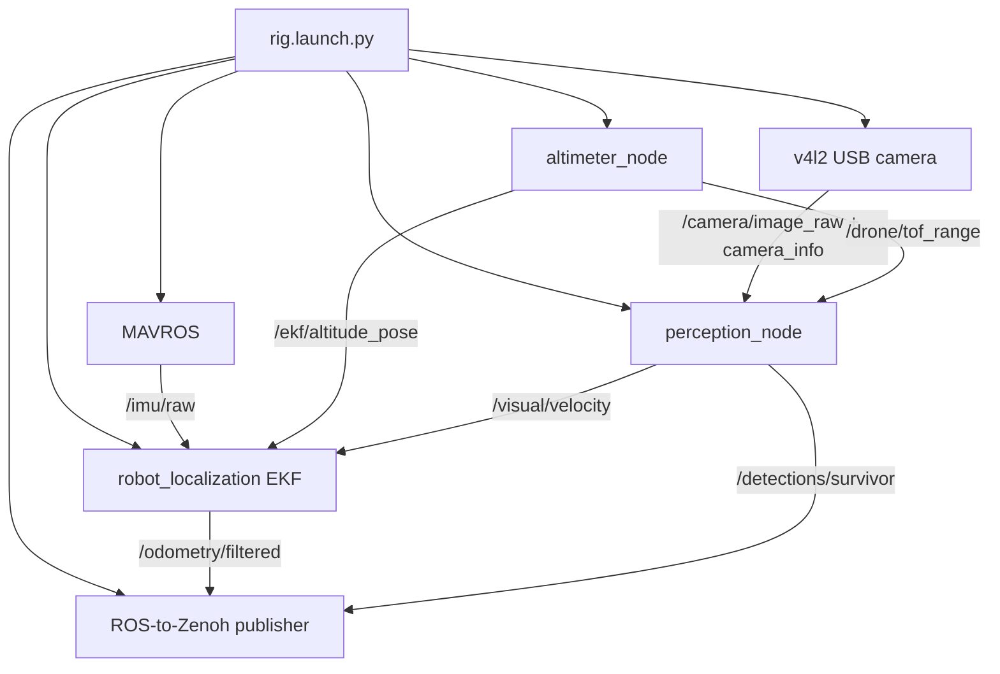

# My Pushpak Work — Zenoh Telemetry and HITL Integration

> Presentation-ready study guide for Kanishk. Read the **60-second answer** first,
> then learn the diagrams and tables. The wording is deliberately simple Hinglish.

---

## 1. My role in one sentence

**My part connects each drone's ROS data to the other drones and to the ground
dashboard through routerless Zenoh telemetry, and prepares the real Jetson rig for
hardware-in-the-loop testing.**

Simple Hindi:

**Mera kaam drone ke andar banne wale ROS data ko safe, compact messages mein convert
karke bina central server ke doosre drones aur ground dashboard tak pahunchana hai.**

My part is the communication and integration layer between:

1. ROS sensors, EKF and perception inside a vehicle.
2. Rust/Zenoh communication between machines.
3. The Python gateway and React dashboard on the ground laptop.
4. Simulation peer 1 and physical Jetson rig peer 2.

---

## 2. The 60-second presentation answer

> My responsibility is the decentralized telemetry and HITL integration of Pushpak.
> Each vehicle runs ROS 2 internally. I take two trusted ROS outputs: filtered
> odometry for position and survivor detections from perception. A Python ROS adapter
> validates freshness and coordinate frames, converts metres to millimetres and
> radians to centidegrees, and passes compact JSON records to a Rust publisher. The
> Rust process encodes those records using our frozen Protobuf schema and publishes
> them over Zenoh in peer mode. There is no Redis and no `zenohd` broker. Ground peer
> 0, scout peer 1 and rig peer 2 can communicate directly. The ground gateway decodes
> the same Protobuf messages, applies the same validation rules, and sends fleet
> snapshots over WebSocket to the React dashboard. The dashboard shows each drone's
> live position, link loss, recovery and survivor events separately. I also prepared
> the fixed IP plan, final unarmed Jetson launch, rig parameters, startup scripts and
> evidence-capture procedure. Physical three-machine and hardware acceptance still
> has to be performed after the hardware arrives.

---

## 3. What is mine, what I integrate, and what is outside my current part

| Area | My responsibility | Status |
|---|---|---|
| Frozen telemetry messages | Protobuf messages for heartbeat, pose keyframe and survivor event | Implemented |
| Rust telemetry library | Peer-mode Zenoh, publish/subscribe, validation and liveness | Implemented and tested |
| Replay peer | Replays CSV movement to test two laptops without ROS/hardware | Implemented and tested |
| ROS-to-Zenoh adapter | Reads odometry/detections, validates and converts units | Implemented and tested |
| HITL Rust publisher | Encodes adapter input and publishes through Zenoh | Implemented and tested |
| Ground gateway | Zenoh/Protobuf to WebSocket fleet snapshots | Implemented and tested |
| Dashboard integration | Separate scout/rig state, position, loss/recovery and victims | Implemented and tested locally |
| Jetson rig setup | Launch, parameters, fixed IPs and start scripts | Prepared; hardware run pending |
| Perception algorithm | Produces `/detections/survivor` and `/visual/velocity` | Teammate module; my code consumes its output |
| EKF/navigation estimation | Produces `/odometry/filtered` | Teammate/base module; my code consumes its output |
| Exploration/backtracking | Mission decisions and autonomous search | Not implemented in the current mission brain |
| Gas/ultrasonic/IoT transport | Physical drivers and message/dashboard contract | Still to be designed and implemented |

The honest boundary to say in the presentation:

> I own the telemetry and HITL integration path. I do not claim that I wrote the
> complete perception algorithm or autonomous exploration. I connect their outputs
> into the decentralized communication and dashboard pipeline.

---

## 4. The complete architecture



Important points:

- **Peer 0 is a computer, not a drone.** It is the ground station.
- **Peer 1 and peer 2 are the two displayed vehicles.** That is why the dashboard
  currently shows only two drones.
- The triangle matters: scout and rig have a direct connection. Losing ground peer 0
  must not stop peer 1 and peer 2 from exchanging telemetry.
- ROS 2 is used inside a machine. Zenoh is used between machines. WebSocket is used
  only between the ground gateway and browser dashboard.

---

## 5. How one position update travels



### Why so many steps?

- ROS messages are convenient inside the drone but are larger and tied to ROS.
- Protobuf gives a compact, fixed cross-language wire format.
- Rust owns the network transport for speed and safety.
- Python connects easily to ROS and the browser gateway.
- The React dashboard should never decode raw ROS or raw Zenoh itself.

---

## 6. The three telemetry messages

Defined in `proto/pushpak.proto`:

| Message | Meaning | Main fields | Normal rate |
|---|---|---|---:|
| `Heartbeat` | “I am alive” | time, drone ID, status flags | 2 Hz |
| `SubMapKeyframe` | Current pose summary | XYZ mm, roll/pitch/yaw centidegrees, flags | 5 Hz |
| `SurvivorEvent` | Person/survivor found | survivor ID, XYZ mm, confidence %, hit count | Event-based |

Zenoh keys are:

```text
pushpak/heartbeat/<drone_id>
pushpak/keyframe/<drone_id>
pushpak/survivor/<drone_id>
```

Example:

```text
pushpak/keyframe/2
```

The topic says drone 2, and the Protobuf body must also say drone 2. If they disagree,
the receiver rejects the message.

### Why integer units?

| Real value | Wire value | Example |
|---|---|---|
| metres | signed millimetres | `1.250 m -> 1250 mm` |
| radians | signed centidegrees | `90° -> 9000 cdeg` |
| confidence 0 to 1 | integer percent | `0.93 -> 93` |

This keeps messages small and consistent across Rust and Python.

---

## 7. Safety and validation in my code



Concrete protections:

- Real telemetry requires `pose_source=odometry`; an unspecified source fails.
- Odometry must use frame `odom`.
- Odometry older than `0.5 s` or stamped in the future is not transmitted.
- NaN, infinity, invalid quaternion and integer overflow are rejected.
- Survivor confidence must be between 0 and 100 percent.
- Wire payloads larger than 50 bytes are rejected.
- Zenoh topic identity must match the Protobuf `drone_id`.
- The Python-to-Rust pipe uses a bounded queue of 128 messages so a slow Rust process
  cannot freeze the ROS callback.
- If the Rust child dies, the adapter logs the failure and exits instead of silently
  pretending communication is healthy.
- Mock pose produces repeated warnings and is not used by the final physical launch.

---

## 8. How peer loss and recovery work

Each peer publishes a heartbeat every `500 ms`.



There are two related mechanisms:

1. The Rust telemetry library remembers the monotonic receive time of each peer.
2. The ground gateway marks a vehicle `OFFLINE` when its last heartbeat is at least
   `1.75 s` old.

The dashboard also removes a displayed pose if no new keyframe arrives for `0.75 s`.
This prevents an old position from looking live.

### What happens when ground peer 0 stops?



- The dashboard stops updating because its gateway is on peer 0.
- Scout and rig can continue talking directly.
- Flight behaviour must not depend on the dashboard.
- Current mission control does **not yet** use peer loss for isolation/backtracking;
  transport detection exists, but the brain response remains future work.

---

## 9. Survivor event flow



The adapter does not run YOLO. It receives a validated `SurvivorDetection` from the
perception module, assigns a stable local survivor ID, counts repeated hits, converts
the coordinates and publishes the event.

Dashboard survivor identity includes the drone ID, for example `2:42`. This prevents
drone 1 survivor 42 from being confused with drone 2 survivor 42.

---

## 10. Ground gateway and dashboard

The browser does not connect directly to Zenoh.



Dashboard meanings:

| Display | Actual meaning |
|---|---|
| Ground link connected | Browser WebSocket is connected to peer 0 gateway |
| Drone 1 online | Recent valid heartbeat from SITL scout 1 |
| Drone 2 online | Recent valid heartbeat from physical/tabletop rig 2 |
| Position | Fresh keyframe from selected vehicle, in its own `odom` frame |
| Track | Last 500 changed positions for that selected vehicle |
| Survivor | Valid survivor event received through Zenoh |

Scout and rig tracks are kept separate because their `odom` origins may be different.
They must not be drawn as though both use a shared GPS map.

---

## 11. Why only two drones appear

The test has **three peers but two vehicles**:

| Peer ID | Role | Displayed as drone? |
|---:|---|---|
| 0 | Ground gateway/dashboard machine | No |
| 1 | SITL scout vehicle | Yes |
| 2 | Jetson tabletop rig vehicle | Yes |

Peer 0 publishes heartbeats for network liveness but is not a flying vehicle. The
gateway defaults to tracking vehicle IDs `[1, 2]`. A third drone would require a new
vehicle ID, launch configuration, endpoints and gateway/dashboard tracking entry.

Best presentation wording:

> We are demonstrating three decentralized peers: one ground peer and two vehicle
> peers. Therefore the dashboard correctly displays two drones.

---

## 12. Network configuration

| Machine | Peer | Fixed IP | Ports |
|---|---:|---|---|
| Ground laptop | 0 | `192.168.8.10` | Zenoh `7447`, WebSocket `8765`, dashboard `5173` |
| Ubuntu SITL | 1 | `192.168.8.11` | Zenoh `7447` |
| Jetson rig | 2 | `192.168.8.12` | Zenoh `7447` |
| Travel router | — | `192.168.8.1` | LAN gateway only |

No `zenohd` router is allowed. Each peer runs Zenoh in `peer` mode and knows the
other peer endpoints. Multicast discovery may help, but explicit TCP endpoints make
the demo deterministic.

---

## 13. The physical Jetson rig

The final `hitl/rig.launch.py` starts:



The rig launch is deliberately unarmed:

- It does not start `pushpak_brain`.
- It does not start the takeoff handshake.
- It does not publish actuator setpoints.
- Props remain removed during tabletop testing.

Hardware-specific one-time work after arrival:

1. Create stable `/dev/pushpak-fc` and `/dev/pushpak-camera` udev links.
2. Calibrate the exact camera and save `/opt/pushpak/camera_info.yaml`.
3. Put approved YOLO weights at `/opt/pushpak/yolov8n.pt`.
4. Configure the downward rangefinder or remap an external ROS `Range` topic.

---

## 14. Important files and what to say about them

| File | What it does |
|---|---|
| `proto/pushpak.proto` | Frozen shared message contract |
| `src/pushpak_telemetry/src/lib.rs` | Rust Zenoh peer library, validation and liveness |
| `src/pushpak_peer/src/main.rs` | CSV replay peer used for laptop testing |
| `hitl/zenoh_publisher/ros_adapter.py` | ROS subscriptions, validation, unit conversion and safe queue |
| `hitl/zenoh_publisher/conversion.py` | Pure conversion and survivor tracking functions |
| `hitl/zenoh_publisher/src/main.rs` | Rust publisher receiving adapter JSON and sending Protobuf |
| `tools/zenoh_gateway.py` | Ground Zenoh peer and Protobuf-to-WebSocket gateway |
| `dashboard/src/hooks/useTelemetry.ts` | Receives fleet snapshots and keeps tracks per drone |
| `dashboard/src/App.tsx` | Drone selector and dashboard panels |
| `hitl/rig.launch.py` | Final physical peer 2 launch |
| `hitl/config/rig_params.yaml` | Camera, MAVROS, EKF, perception and Zenoh parameters |
| `hitl/config/network.env` | Canonical peer IP addresses and ports |
| `hitl/start_peer0.sh` | Starts ground gateway and dashboard |
| `hitl/start_peer1.sh` | Starts the unarmed SITL scout |
| `hitl/start_peer2.sh` | Validates hardware files/devices and starts the rig |
| `tools/capture_three_peer_evidence.sh` | Captures date, commit, IPs, `pgrep` and both pings |

---

## 15. Demo sequence to memorise

### Before the presentation

1. Keep all props removed and FC unarmed.
2. Verify all three machines use the same approved Git commit.
3. Run the evidence script on ground, scout and rig.
4. Confirm all logs end with `PREFLIGHT=PASS`.
5. Start peer 0, then peer 1, then peer 2.
6. Open `http://192.168.8.10:5173/`.

### What to demonstrate

1. Select drone 1 and show the SITL scout position.
2. Select drone 2 and move the tabletop rig; show fresh rig position.
3. Stop peer 1. Within about 1.75 seconds drone 1 should become offline, while
   drone 2 remains online.
4. Restart peer 1. Show automatic recovery without restarting the gateway.
5. Present a test person to the rig camera and show the survivor event.
6. Explain that stopping ground removes visibility but does not become a flight
   dependency for the remaining direct peers.

### Exact start commands

```bash
# Peer 0 — ground
bash hitl/start_peer0.sh

# Peer 1 — SITL scout
bash hitl/start_peer1.sh

# Peer 2 — Jetson rig
bash hitl/start_peer2.sh
```

---

## 16. Three-minute detailed speaking script

> Pushpak uses ROS 2 inside each drone and Zenoh between machines. My part is the
> bridge between those two worlds and the ground dashboard. We assign peer 0 to the
> ground station, peer 1 to the SITL scout, and peer 2 to the Jetson rig. Peer 0 is
> not a drone, which is why the dashboard shows two vehicles.
>
> Inside a vehicle, robot_localization publishes filtered odometry and perception
> publishes survivor detections. My Python adapter subscribes to these fixed ROS
> topics. Before sending anything, it checks that the position is in the odom frame,
> is not stale or future-dated, and contains finite values. It converts metres to
> millimetres, quaternion orientation to centidegrees and detection confidence to an
> integer percent. It sends records to Rust through a bounded queue, so a network
> slowdown cannot freeze ROS.
>
> The Rust publisher encodes three Protobuf messages: heartbeat, submap keyframe and
> survivor event. It publishes them on Zenoh keys containing the drone ID. Both sender
> and receiver reject a message above 50 bytes or one whose topic ID and body ID do
> not match. Zenoh runs in peer mode, so there is no central Redis server or zenohd
> router. Scout, rig and ground form direct peer connections.
>
> On the ground, a Python Zenoh gateway validates and decodes the binary messages.
> It keeps scout and rig state separate, because their odom origins are different.
> Every 200 milliseconds it sends a fleet snapshot by WebSocket to the React
> dashboard. The dashboard displays fresh position, track, link state and survivor
> events. If heartbeats stop for 1.75 seconds, only that vehicle becomes offline. A
> new heartbeat recovers it automatically.
>
> I also prepared the final unarmed Jetson launch, MAVROS and camera parameters,
> fixed IP plan, peer startup scripts and evidence capture. The remaining acceptance
> work is the real three-machine run with the physical camera, flight controller and
> rangefinder. Exploration, backtracking and extra IoT sensor transport are separate
> incomplete mission features and I do not present them as completed.

---

## 17. Quick viva questions and answers

### Q1. Why Zenoh?

It supports lightweight publish/subscribe and direct peer mode. It lets vehicles
communicate without making one central broker a mission dependency.

### Q2. Why not Redis?

Redis is central-server based. If that server fails, communication depending on it
fails. The v2 invariant requires decentralized peer communication.

### Q3. Why Rust and Python together?

Python integrates naturally with ROS and the dashboard. Rust handles the transport
and binary message contract with strong type and memory safety. The boundary is small
and tested.

### Q4. What is Protobuf doing?

It defines the same compact binary message structure for Rust and Python. It prevents
each component from inventing a different JSON field format over the network.

### Q5. How do you detect a lost peer?

Each peer sends a heartbeat every 0.5 seconds. If none arrives for 1.75 seconds, the
peer is treated as lost/offline. A later valid heartbeat marks it alive again.

### Q6. Does the ground station control the drones?

In this telemetry path, no. Ground observes telemetry and publishes its own heartbeat.
The vehicles have a direct link and can continue exchanging data if ground stops.

### Q7. Why are only two drones shown?

There are three peers but only two vehicle peers. Peer 0 is ground, peer 1 is the SITL
scout and peer 2 is the rig.

### Q8. Can drone 1 and drone 2 positions be placed on one global map?

Not safely yet. Each uses its own GPS-denied `odom` origin. The dashboard keeps their
tracks separate instead of pretending they share a global coordinate system.

### Q9. What happens with stale odometry?

The adapter does not send a keyframe if the odometry is older than 0.5 seconds, is
future-stamped or has the wrong frame. The dashboard later clears an old pose.

### Q10. What if the Rust publisher crashes?

The Python adapter detects the closed pipe, logs the failure and terminates. It does
not silently continue or block ROS callbacks.

### Q11. What has been physically verified?

The older two-laptop test verified direct telemetry, peer loss and recovery. The
current scout-rig-ground integration was verified locally with real Rust, Zenoh,
Python and browser processes. The final physical three-machine Jetson/FCU/camera test
is still pending and should be stated honestly.

### Q12. Are gas and ultrasonic sensors included?

The downward ToF/range input is integrated for altitude. General tabletop gas,
ultrasonic and other IoT devices still need their ROS drivers and an agreed transport
contract because the frozen drone Protobuf has no fields for them.

---

## 18. Numbers to remember

| Number | Meaning |
|---:|---|
| `0` | Ground peer ID |
| `1` | SITL scout ID |
| `2` | Jetson rig ID |
| `7447` | Zenoh TCP port |
| `8765` | Gateway WebSocket port |
| `5173` | Dashboard port |
| `2 Hz` | Heartbeat rate |
| `5 Hz` | Keyframe rate |
| `1.75 s` | Link-loss timeout |
| `0.75 s` | Ground pose freshness |
| `0.5 s` | ROS odometry freshness limit |
| `50 bytes` | Maximum accepted wire payload |
| `128` | Adapter queue capacity |
| `500` | Dashboard track-point limit per drone |
| `1.5 m` | Nearby detection radius for stable survivor ID |

---

## 19. Words to avoid during the presentation

Do not say:

- “The full autonomous mission is complete.”
- “All IoT sensors are integrated.”
- “Three drones are running.”
- “We have a shared GPS/global map.”
- “The physical three-machine test has passed.”
- “Peer loss automatically makes the drone backtrack.”

Say instead:

- “The telemetry-to-dashboard and HITL integration path is implemented.”
- “The demo uses three peers and two vehicle peers.”
- “Peer loss is detected and displayed; mission response is pending.”
- “Tracks remain in separate local odom frames.”
- “The hardware-ready setup is complete; physical acceptance follows hardware arrival.”

---

## 20. Final memory formula

```text
ROS data
  -> validate
  -> convert units
  -> bounded Python-to-Rust bridge
  -> Protobuf
  -> Zenoh peer mesh
  -> ground gateway
  -> WebSocket
  -> dashboard
```

Remember this short line:

**Sense locally, validate locally, communicate peer-to-peer, display centrally,
but never depend on the display for flight.**
