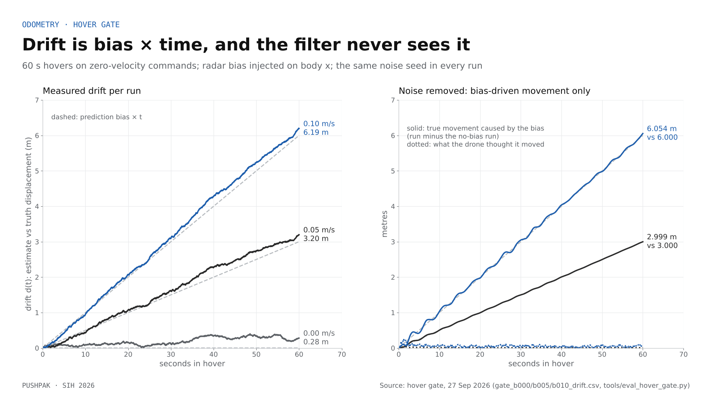
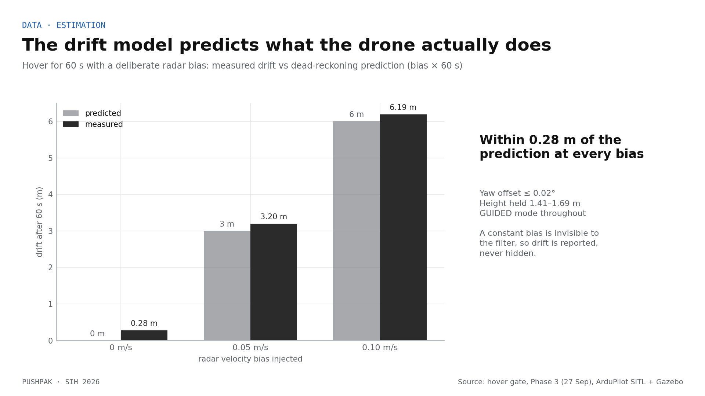
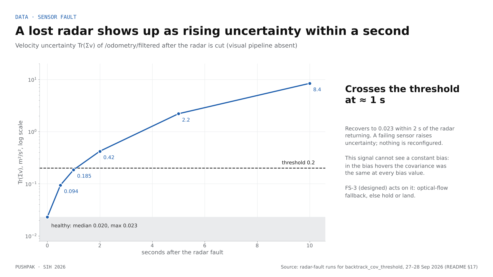
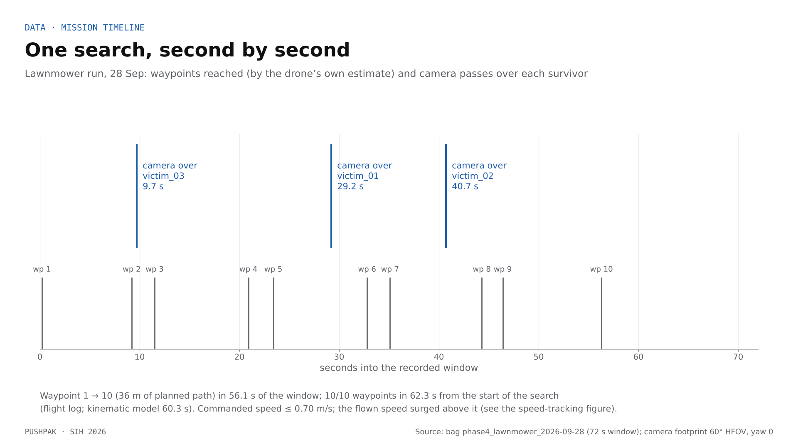
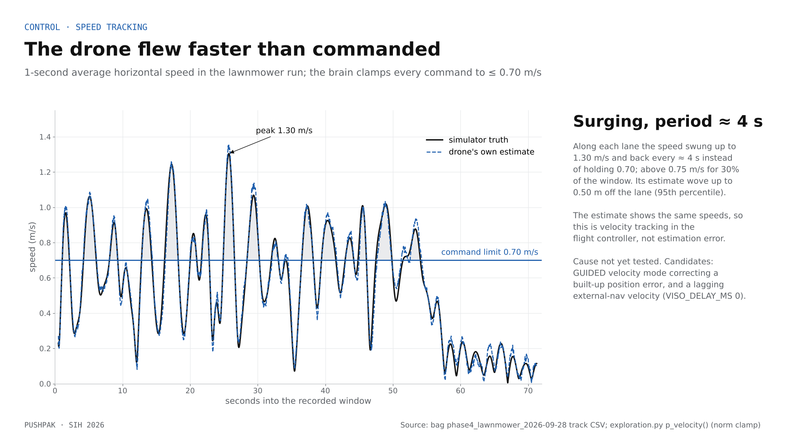

# PUSHPAK · Odometry analysis

How well Drone B knows where it is without GPS, measured in simulation, and what those measurements do and do not prove.

## Summary

1. **Drift is bias × time, exactly.** In 60 s hovers with an injected radar bias of 0.05 and 0.10 m/s, the bias-driven movement was 2.999 m and 6.054 m against predictions of 3.000 and 6.000 m once the shared noise is removed. The filter did not notice: its own estimate differed between runs by 0.009 m and 0.074 m.
2. **With zero bias, the error is integrated radar noise.** Over the 72 s lawnmower search the absolute error averaged 0.58 m (max 0.80 m). That is the emulator's noise floor, not a real radar's performance.
3. **A lost radar is visible within a second** as rising velocity uncertainty (Tr(Σv) crosses 0.2 at about 1 s). **A biased radar is not visible at all**: the uncertainty was identical at every bias value.
4. **The flight controller does not hold the commanded speed.** Commands are clamped to 0.70 m/s, yet the drone surged to 1.30 m/s about every 4 s. The estimate shows the same speeds, so this is control, not estimation.
5. **Field consequence:** with a 0.05 m/s bias, a 1 m error budget lasts about 20 s. Bias detection (radar vs optical flow) and absolute resets (UWB at the entrance) are therefore requirements, not extras.

## 1. The estimator as built

Drone B carries no GNSS receiver and uses no compass. Horizontal position is dead-reckoned (invariant I-1).

| Input | What it gives | Producer in simulation | Producer on hardware (design) |
|---|---|---|---|
| IMU, 200 Hz | angular rates, roll and pitch | Gazebo `ros_imu` | flight-controller IMU via MAVROS |
| Radar ego-velocity, 20 Hz | body-frame velocity | `sim_radar_emulator_node`: truth + N(0, 0.15 m/s) + optional bias | TI IWR6843 + Doppler ego-velocity estimator |
| ToF rangefinder, 30 Hz | height above the nearest surface (≤ 4 m) | Gazebo 1D lidar → `altimeter_node` | VL53L1X |

`robot_localization` (15-state EKF, 50 Hz) fuses these into `/odometry/filtered`; `vio_bridge_node` sends that to ArduPilot EKF3 as external navigation. Absolute yaw is never fused: heading is integrated from the gyro.

**Known flaw.** The IMU is fused twice: once in `robot_localization` (which has no bias states) and again inside EKF3, which receives the first filter's output as if it were an independent "vision" measurement. The committed fix is one filter: radar velocity and the rangefinder fused directly in EKF3, with an optical-flow fallback (`docs/GPS_INDEPENDENCE.md`).

## 2. The drift law: hover gate, 27 Sep

Three 60 s hovers on zero-velocity commands from `pushpak_brain`. The radar emulator seed and the Gazebo seed are fixed and identical in all three runs; only the injected bias on body x changes (0, 0.05, 0.10 m/s). The metric d(t) is the horizontal distance between the estimate's displacement and truth's displacement since takeoff, after aligning the two frames by their yaw at t₀ (README §17).

| Bias | Predicted b × 60 s | Measured d(60 s) | Error | Fitted slope | Estimate moved | Truth moved |
|---|---|---|---|---|---|---|
| 0 | 0 m | 0.280 m | +0.28 m | 0.31 m/min | 0.12 m | 0.33 m |
| 0.05 m/s | 3.00 m | 3.196 m | +0.20 m | 3.33 m/min | 0.11 m | 3.14 m |
| 0.10 m/s | 6.00 m | 6.193 m | +0.19 m | 6.33 m/min | 0.15 m | 6.19 m |

The gate passed: GUIDED and armed throughout, |d(60) − b × 60| ≤ 0.8 m in every run, yaw offset at t₀ ≤ 0.02°, true height 1.46–1.74 m.

**Removing the shared noise.** Because all three runs share one noise realisation, subtracting the bias-0 run from the others leaves only the effect of the bias:

| Bias | True movement caused by the bias at 60 s | Prediction | Fitted rate | Estimate difference between runs |
|---|---|---|---|---|
| 0.05 m/s | 2.999 m | 3.000 m | 0.0500 m/s | 0.009 m |
| 0.10 m/s | 6.054 m | 6.000 m | 0.1001 m/s | 0.074 m |

The movement points along −x (the bias was +x on the radar, so the drone flies backwards while believing it is still). The estimate barely moves in any run.



**What this proves.** The estimator passes a constant velocity bias straight into position, one to one, and nothing inside it can tell. That is the expected behaviour of a filter with no bias state for an external velocity, and it is why the drift is reported, never hidden.

**What it does not prove.** The emulator adds the bias by construction, so the result validates the pipeline (filter, bridge, controller), not a radar. How large a real IWR6843's bias is, and how it changes with temperature, motion and surface, is unmeasured.



## 3. The white-noise floor

With zero bias, the error comes from integrating radar white noise. Per horizontal axis, its standard deviation after t seconds is σ_v · √(Δt · t) = 0.15 m/s × √(0.05 s × t): **0.26 m at 60 s** and 0.28 m at 72 s. The two-axis distance has a 99 % bound of about 0.8 m at 60 s, which became the hover-gate tolerance.

Observed: 0.28 m after 60 s in the zero-bias hover; 0.47 m of in-window drift after 72 s of the search. Both sit inside the noise model. The noise level itself (σ 0.15 m/s) was chosen inside the 0.10–0.28 m/s ego-velocity RMSE reported for a radar-inertial system on a quadrotor by Kramer et al. (ICRA 2020); it is a citation, not a measurement of our sensor.

## 4. Detecting a failed sensor: Tr(Σv)

When the radar is cut (injected fault, visual pipeline absent), the trace of the velocity covariance of `/odometry/filtered` rises from a healthy maximum of 0.023 m²/s² to 0.094 at 0.5 s, 0.185 at 1 s, 0.42 at 2 s, 2.2 at 5 s and 8.4 at 10 s. It falls back to 0.023 within 2 s of the radar returning. Growth is faster than linear because the unobserved acceleration states feed velocity.

The FS-3 threshold is 0.2, about 9× the healthy maximum, crossed about 1 s after radar loss. It was derived with robot_localization's default process noise; changing Q or the fusion matrix invalidates it.



**Limit.** In the bias hovers the covariance was the same at every bias value. Tr(Σv) detects a missing sensor, never a biased one. Bias needs a second, independent velocity source (`docs/GPS_INDEPENDENCE.md` §4).

## 5. The lawnmower search, 28 Sep

Radar bias 0. The drone flies a 6 × 6 m lawnmower (1.5 m lanes, 10 waypoints) on its own estimate. The track CSV has 3,589 samples at 50 Hz over 71.8 s.

| Metric | Mean | Max | Final |
|---|---|---|---|
| Absolute error, \|estimate − truth\| | **0.583 m** | 0.798 m (at 62.0 s) | 0.760 m |
| Drift within the window (starting offset removed) | 0.297 m | 0.513 m | 0.468 m |

- The estimate was already 0.30 m off when the recording window began; that offset accumulated between takeoff and the first waypoint.
- A straight-line fit of the absolute error grows at about 0.35 m per minute. With zero bias this is noise accumulation, not a trend that extrapolates.
- As a share of the 36 m planned path, the mean and maximum errors are about 1.6 % and 2.2 %. This ratio depends on the noise model and is not a property of the system.
- Survivor pins inherit the absolute error. In run R1 the latest-fix errors were 0.37–1.61 m; the largest is mostly the dashboard keeping the latest fix, not estimator drift (`docs/EVIDENCE.md`).


Waypoints 1 → 10 (36 m of planned path) took 56.1 s of the window; the camera footprint passed over victim_03 at 9.7 s, victim_01 at 29.2 s and victim_02 at 40.7 s.



## 6. Speed tracking: a control finding

`pushpak_brain` commands a velocity toward the next waypoint, `v = kp × error`, with the norm clamped to 0.70 m/s (`exploration.p_velocity`). Simulator truth shows the drone did not fly at that speed:

- 1-second average speed peaked at **1.30 m/s** (1.40 m/s over 0.2 s);
- along each lane the speed surged and fell with a period of about 4 s (dominant frequency 0.25 Hz) instead of holding 0.70 m/s;
- it was above 0.75 m/s for 30 % of the window, and the estimate wove up to 0.50 m off the lane (95th percentile);
- between waypoints 1 and 10 it flew 39.3 m (truth) to cover 36 m of planned path.

The drone's own estimate shows the same speeds (peak 1.35 m/s), so the brain knew it was going fast and kept commanding ≤ 0.70 m/s. The excess comes from the flight controller's velocity tracking, not from estimation error.



**Candidate causes (untested).**
1. ArduPilot's GUIDED velocity control builds a position target from the velocity command and corrects position error; if the vehicle lags, the correction adds speed above the command.
2. The external-navigation velocity reaches EKF3 late (radar 20 Hz → EKF 50 Hz → bridge 30 Hz), while `VISO_DELAY_MS` is 0. A lagging velocity estimate inside a velocity loop produces exactly this kind of overshoot and surging.

**Test.** Record `/mavros/setpoint_velocity/cmd_vel`, `/mavros/local_position/velocity_local` and truth together; repeat with `VISO_DELAY_MS` set to the measured pipeline latency. Surging matters: it lengthens the path, blurs detection frames and spends battery.

## 7. Error budget for the field

| Source | Size | Consequence |
|---|---|---|
| Radar velocity bias b | error ≈ b × t | 1 m budget lasts 1/b seconds: 20 s at 0.05 m/s, 10 s at 0.10 m/s |
| Radar white noise σ | ≈ 0.26 m per axis after 60 s at σ 0.15 m/s | grows with √t; small next to any real bias |
| Heading error Δψ | lateral error ≈ distance × sin Δψ | 1° → 0.52 m at 30 m; 5° → 2.6 m at 30 m |
| Rangefinder | height above the nearest slab, ≤ 4 m, weak in dust | camera-to-ground projection error for pins; altitude ceiling |
| Pin projection | camera pose at publish time, latest fix kept | 1.61 m in run R1 for one survivor |

Holding 1 m inside a structure therefore needs one of: a measured real-radar bias well below 0.05 m/s, a bias detector (radar vs optical-flow consistency), or absolute resets (UWB anchors at the entrance) at least every 1/b seconds. Deep inside a structure the anchors may be out of reach, which is why relay nodes and short sorties are in the design.

## 8. What this analysis cannot show

- Real radar behaviour: bias, scale factor, mounting angle, multipath off concrete. Scale and mounting errors grow with speed and vanish in hover, so the hover gate does not test them.
- Heading drift near rebar and cables: simulated gyro has no bias (scaffold S-7), giving about 0.02° per minute.
- Dust, smoke and darkness: the optical-flow pipeline (Pipeline A) is parked, and the camera sees clean renders.
- Wind, downwash, ground effect: out of scope in simulation.
- Anything about flight hardware: nothing has flown.

## 9. Next experiments

1. Real IWR6843 on the bench with the Doppler ego-velocity estimator: measure bias at rest and on a moving cart.
2. Single-filter estimator (radar + rangefinder into EKF3) and repeat the hover gate and lawnmower runs.
3. Speed-tracking test from §6.
4. Radar vs optical-flow consistency check: inject a bias and measure how fast the check flags it.
5. Lawnmower with injected bias 0.05 m/s, to measure pin error under the drift law during motion.

## Reproduce

```bash
# hover gate (in the container, bags from the team drive)
python3 tools/eval_hover_gate.py bags/gate_b000:0.0 bags/gate_b005:0.05 bags/gate_b010:0.10
# lawnmower statistics and checks (PR #39 tool)
python3 tools/animate_track.py --csv bags/phase4_lawnmower_2026-09-28_track.csv --victims victims.json --check-only
```

`eval_hover_gate.py` writes the `*_drift.csv` files used above. The noise-removed comparison and the speed analysis were computed from those CSVs and the lawnmower track CSV.

## References

- Kramer, A. et al. (2020). Radar-Inertial Ego-Velocity Estimation for Visually Degraded Environments. IEEE ICRA.
- Doer, C. & Trommer, G. F. (2020). An EKF Based Approach to Radar Inertial Odometry. IEEE MFI.
